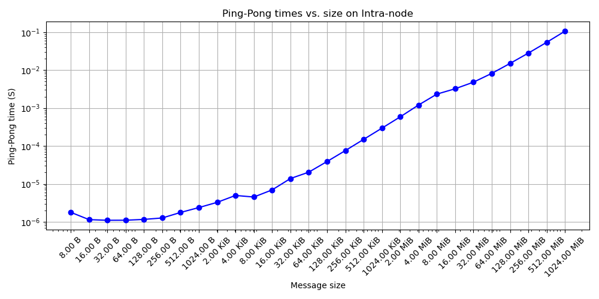
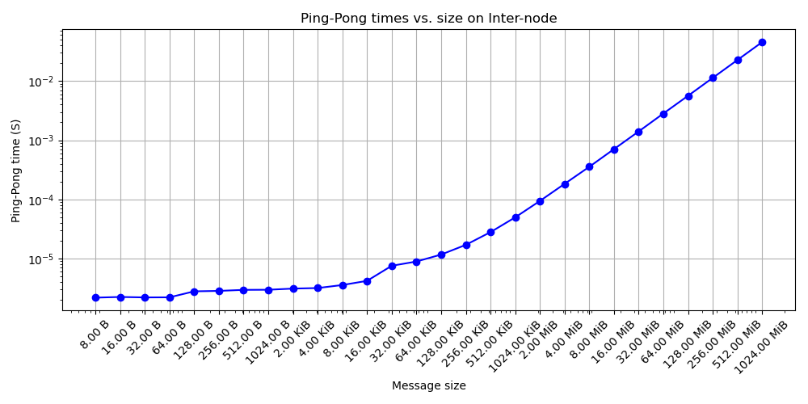
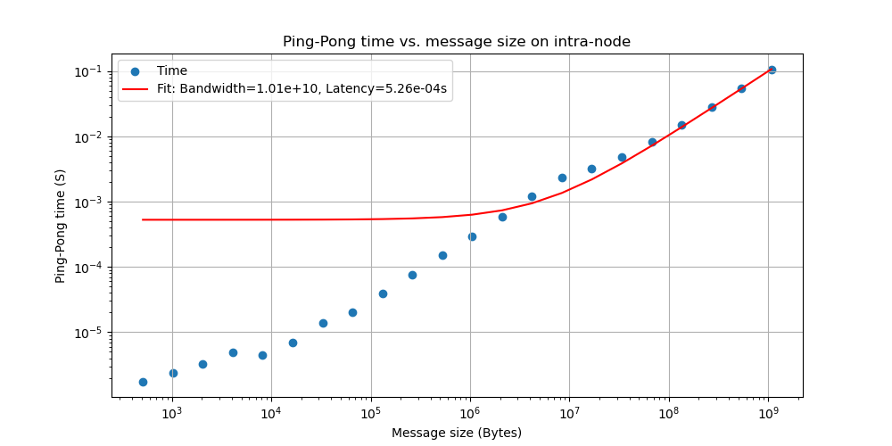
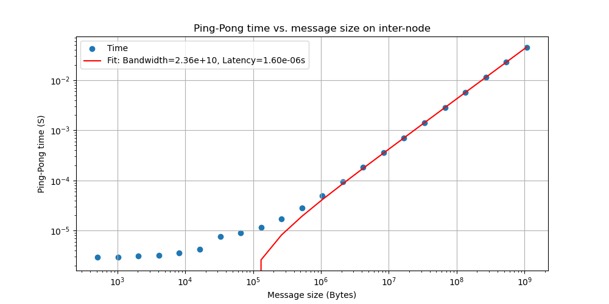
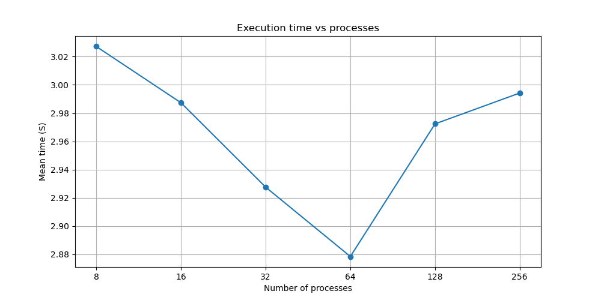

# HPC3
The assignment has been carried out on both Dardel and personal computers. Exercises 3 and 4 were done on a personal computer, while Exercises 1 and 2 were done on Dardel.

## Exercise 1 - MPI Hello World
--

## Exercise 2 - Measure Network Bandwidth and Latency on Dardel with Ping-Pong

## Exercise 3 - Why MPI_Send and MPI_Recv are called "blocking "communication?
It is because MPI_Send and MPI_Recv blocks the calling process until the data is safely copied out of the send buffer or fully received into the buffer.

## Exercise 4 - Calculate PI with MPI

